# homa rpc rtt

- require
  - [tinet](https://github.com/tinynetwork/tinet)
  - docker

## topology

## 使い方
1. Create virtual env
    - `make env`
        - Build required docker images
        - Compile the P4 program
        - Setup topology with tinet

2. Run P4 Switch
    - `make run`
      - Bmv2 simple_switch will run with no config

3. Insert Runtime Config Rule to P4 Switch
    - `make set-config`
      - ref: `P4/runtime.txt`

- `make help` will help you.
  - You can see an overview of make rules not listed here.